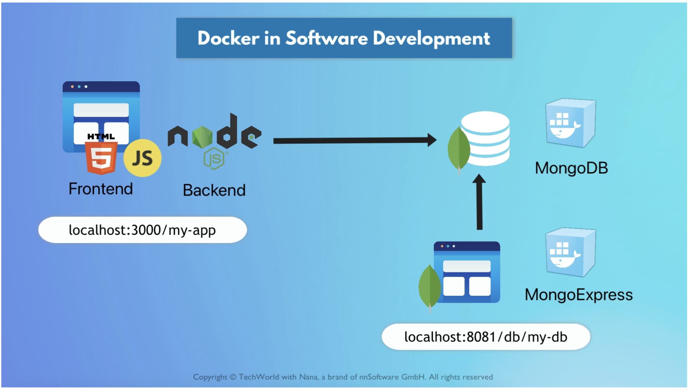

# DevOps project: js-mongodb-app

This project illustrates a robust approach to automating the creation and configuration of cloud resources using Terraform and Ansible, addressing common challenges such as timing issues and dynamic IP address assignment.

## DevOps stack

### Docker-Based MongoDB and Node.js App

Docker provides a consistent and isolated environment for applications and their dependencies, ensuring that the software behaves the same way across different development stages and deployment environments.

A simple user profile app set up using:

- App:
  - index.html with pure js and css styles
  - nodejs backend with express module
- MongoDB for data storage
- MongoExpress: UI to manage the MongoDB database

All 3 components are docker-based.

### Automating EC2 Instance Configuration with Terraform and Ansible

- **Terraform**: Terraform is employed to automatically create AWS resources such as VPC, subnet, Internet Gateway, security group, and EC2 instances. It serves as the foundation for infrastructure provisioning.

- **Ansible**: Ansible is used for configuring the newly created EC2 instance. It plays a crucial role in ensuring the server is set up correctly with all the required software and configurations.

  - Dynamic IP Address Assignment: To address the issue of dynamic IP addresses for EC2 instances, the project dynamically retrieves the IP address of the newly created server and passes it as an inventory parameter to Ansible.

  - Waiting for SSH Connection: To ensure timing issues do not disrupt the process, a special Ansible play is added at the beginning. It waits for the SSH port on the server to become accessible before proceeding with other tasks.

  - Null Resource for Separating Ansible Execution: A null resource is introduced to separate the Ansible playbook execution from the EC2 instance creation. This null resource triggers Ansible execution when the IP address of the EC2 instance changes, ensuring synchronization.

  - Output Verification: The successful execution of the project is verified by checking if the Docker containers are running on the newly configured EC2 instance.

